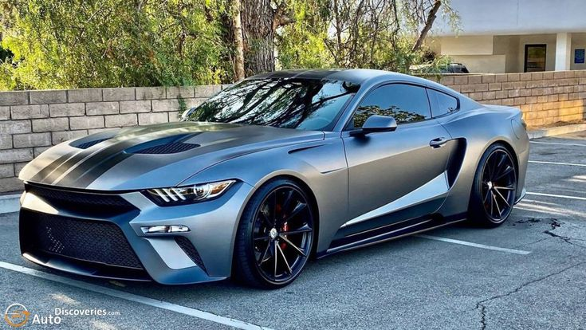
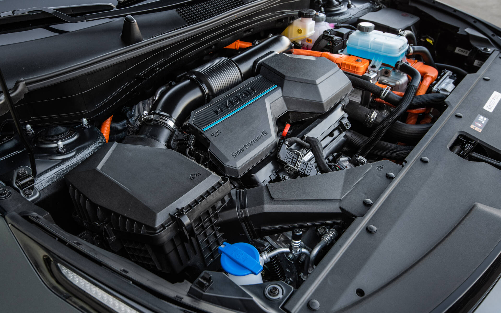
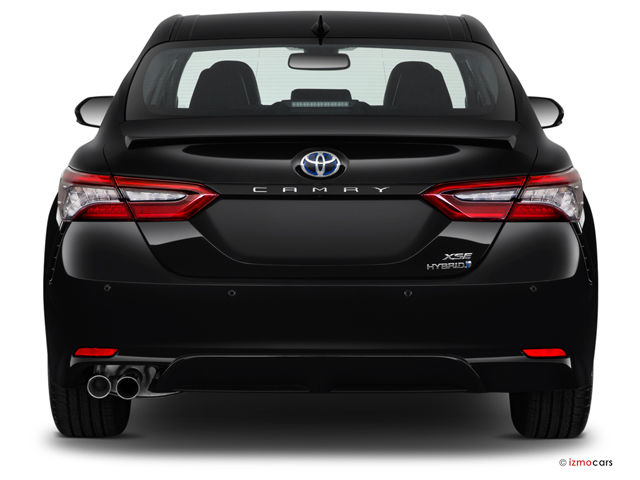
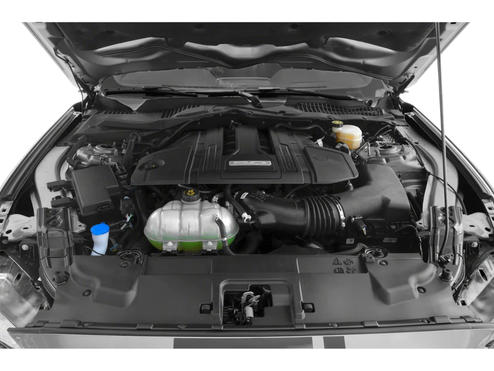
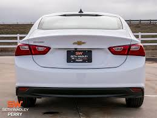
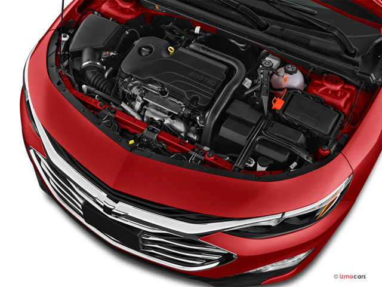

#  Modern-AutoMobiles Website:
#  Html
!DOCTYPE html>
<html lang="en">
<head>
    <meta charset="UTF-8">
    <meta name="viewport" content="width=device-width, initial-scale=1.0">
    <title>Modern Cars</title>
    <link rel="stylesheet" href="page1.css">
</head>
<body>
    <!-- Header -->
    <header>
        <nav>
            
Modern Cars

            <ul class="nav-links">
                <li><a href="#compare">Compare Cars</a></li>
                <li><a href="#reviews">Reviews</a></li>
                <li><a href="#dealers">Find Dealers</a></li>
                <li><a href="#contact">Contact</a></li>
            </ul>
        </nav>
    </header>

    <!-- Hero Section -->
    <section class="hero">
        <h1>Find the Best Car Deals</h1>
        
Compare car prices, read reviews, and find trusted dealerships near you.

        <button onclick="startComparison()">Start Comparing</button>
    </section>

    <!-- Car Comparison Section -->
    <section id="compare" class="comparison-section">
        <h2>Compare Car Models</h2>
        

            

                
                <h3>Model: 2023 <a href="car1detail.html"> Honda Civic</a></h3>
                
Price: &#8377;21,00,000 *Ex-Showroom

                
Fuel Efficiency: 35 MPG

            

            

                
                <h3>Model: 2023 <a href="car2detail.html"> Kia Sportage</a></h3>
                
Price: &#8377;22,70,000 *Ex-Showroom

                
Fuel Efficiency: 27 MPG

            

            

                
                <h3>Model: 2023 <a href="car3detail.html"> Hyundai Tucson</a></h3>
                
Price: &#8377;22,70,000 *Ex-Showroom

                
Fuel Efficiency: 28 MPG

            

            

                
                <h3>Model: 2023 <a href="car4detail.html"> Toyota Camry</a></h3>
                
price: &#8377;22,70,000 *Ex-Showroom

                
Fuel Efficiency: 33 MPG

            

            

                
                <h3>Model: 2023 <a href="car5detail.html"> Ford Mustang</a></h3>
                
price: &#8377;25,24,000 *Ex-Showroom

                
Fuel Efficiency: 20 MPG

            

            

                
                <h3>Model: 2023 <a href="car6detail.html"> Chevrolet Malibu</a></h3>
                
price: &#8377;24,40,000 *Ex-Showroom

                
Fuel Efficiency: 32 MPG

            

        

    </section>
    

    <!-- Reviews Section -->
    <section id="reviews" class="reviews-section">
        <h2>Customer Reviews</h2>
        

            
"The car buying experience was smooth and seamless!"

            <strong>- John D.</strong>
        

        

            
Great site! Easy to navigate and tons of helpful info. Found my perfect car quickly!

            <strong>- Sarah K.</strong>
        

        

            
"I found the perfect car at a great price!"

            <strong>- Michael P.</strong>
        

        

            
"Amazing prices and great customer service!

            <strong>- Silverado C.</strong>
        

        

            
Comprehensive listings and solid reviews. A bit of outdated info, but overall a great resource!

            <strong>- Sonata H.</strong>
        

    </section>
    

    <!-- Find Dealers Section -->
    <section id="dealers" class="dealers-section">
        <h2>Find Trusted Dealers</h2>
        

            <h3>Auto Oasis</h3>
            
Location: Jalandher

            <button onclick="contactDealer()" class="dealer_contact"> Contact Car Dealer </button>
        

        

            <h3>Next Gen Cars</h3>
            
Location: Delhi

            <button onclick="contactDealer()" class="dealer_contact"> Contact Car Dealer </button>
        

        

            <h3>Road Ready Motors</h3>
            
Location: Noida

            <button onclick="contactDealer()" class="dealer_contact"> Contact Car Dealer </button>
        

    </section>

    <!-- Footer -->
    <footer>
        
&copy; 2024 CarCompare. All rights reserved.

    </footer>

    
</body>
</html>

--------------------------------------------------------------------------------------------------------------------------------------------------------------------------------------------------------------------
#  css
/* Global Styles */
* {
    margin: 0;
    padding: 0;
    box-sizing: border-box;
}

body {
    font-family: 'Arial', sans-serif;
    line-height: 1.6;
    background-color: #f4f4f4;
    color: #333;
}

header {
    background-color: #333;
    color: white;
    padding: 10px 20px;
    position: fixed;
    width: 100%;
    top: 0;
    z-index: 1000;
}

nav {
    display: flex;
    justify-content: space-between;
    align-items: center;
}

.logo {
    font-size: 24px;
    font-weight: bold;
    text-transform: uppercase;
    color: #ff5722;
}

.nav-links {
    list-style: none;
    display: flex;
}

.nav-links li {
    margin-left: 20px;
}

.nav-links a {
    color: white;
    text-decoration: none;
}

/* Hero Section */
.hero {
    height: 100vh;
    background: url('hero.jpg') no-repeat center center/cover;
    display: flex;
    flex-direction: column;
    justify-content: center;
    align-items: center;
    text-align: center;
    color: white;
    padding: 0 20px;
    background-image: url(image1.jpg);
}

.hero h1 {
    font-size: 3rem;
}

.hero p {
    font-size: 1.5rem;
}

.hero button {
    background-color: #ff5722;
    color: white;
    padding: 10px 20px;
    border: none;
    border-radius: 5px;
    cursor: pointer;
    margin-top: 20px;
}

/* Comparison Section */
.comparison-section {
    padding: 50px;
    background-color: #fff;
    text-align: center;
}

.car-comparison {
    display: flex;
    justify-content: space-around;
    flex-wrap: wrap;
}

.car {
    background-color: #f8f8f8;
    padding: 20px;
    border-radius: 10px;
    width: 30%;
    margin: 20px;
}

.car img {
    border-radius: 10px;
    width: 300px;
    height: 200px;
    object-fit: cover;
}

/* Reviews Section */
.reviews-section {
    background-image: url(image2.jpg);
    padding: 50px;
    text-align: center;
    background-size: cover;
    background-position: center;
    background-repeat: no-repeat;
}

.review {
    background-color: #27b3dbc7;
    padding: 20px;
    margin: 20px;
    border-radius: 10px;
    max-width: 500px;
    margin: 20px auto;
    color: black;
}

/* Dealers Section */
.dealers-section {
    padding: 50px;
    text-align: center;
}

.dealer {
    background-color: #f8f8f8;
    padding: 20px;
    border-radius: 10px;
    margin: 20px;
    display: inline-block;
    background-color: #fbbf606b;
    border: 3px solid black;
}

/* Footer */
footer {
    background-color: #333;
    color: white;
    text-align: center;
    padding: 10px 0;
}
.dealer_contact {
    background-color: rgb(171 255 255 / 70%);
    color: black;
    border: 2px solid black;
}
--------------------------------------------------------------------------------------------------------------------------------------------------------------------------------------------------------------------
#  Js
// Handle Car Comparison
function startComparison() {
    window.location.href = "#compare";
}

// Contact Dealer Alert
function contactDealer() {
    alert("Thank you for your interest! The Car dealer contact number : +91 98560-98560.");
}
--------------------------------------------------------------------------------------------------------------------------------------------------------------------------------------------------------------------
#  Some other Pages of Website:
<!DOCTYPE html>
<html lang="en">
<head>
    <meta charset="UTF-8">
    <meta name="viewport" content="width=device-width, initial-scale=1.0">
    <title>2023 Honda Civic</title>
    
</head>
<body>

    <h1>2023 Honda Civic</h1>

    

        
        
        
        
    

    <h2>Specifications</h2>
    <ul>
        <li><strong>Engine:</strong> 2.0L 4-cylinder engine</li>
        <li><strong>Horsepower:</strong> 158 hp</li>
        <li><strong>Transmission:</strong> Continuously Variable Transmission (CVT)</li>
        <li><strong>Fuel Economy:</strong> 31 city / 40 highway mpg</li>
        <li><strong>Seating Capacity:</strong> 5 passengers</li>
        <li><strong>Drivetrain:</strong> Front-Wheel Drive</li>
    </ul>

    <h2>Features</h2>
    <ul>
        <li>Honda Sensing® Safety Suite</li>
        <li>Apple CarPlay® and Android Auto™ Integration</li>
        <li>7-inch Display Audio Touchscreen</li>
        <li>Multi-Angle Rearview Camera</li>
        <li>LED Headlights</li>
        <li>Adaptive Cruise Control</li>
    </ul>

    <h2>Pricing</h2>
    
Starting at <strong> &#8377;21,00,000 </strong>

    <a href="page1.html">Go to main Website</a>

</body>
</html>
--------------------------------------------------------------------------------------------------------------------------------------------------------------------------------------------------------------------
<!DOCTYPE html>
<html lang="en">
<head>
    <meta charset="UTF-8">
    <meta name="viewport" content="width=device-width, initial-scale=1.0">
    <title>2023 Kia Sportage</title>
    
</head>
<body>

    <h1>2023 Kia Sportage</h1>

    

        
        
        
        
    

    <h2>Specifications</h2>
    <ul>
        <li><strong>Engine Options:</strong></li>
        <ul>
            <li>2.5L 4-Cylinder: 187 hp, 178 lb-ft</li>
            <li>1.6L Turbocharged: 227 hp, 258 lb-ft (Hybrid Option)</li>
        </ul>
        <li><strong>Transmission:</strong> 8-Speed Automatic</li>
        <li><strong>Drivetrain:</strong> FWD or AWD</li>
        <li><strong>Fuel Economy:</strong> 25 city / 32 highway mpg (2.5L)</li>
        <li><strong>Dimensions:</strong> Length: 183.5 in, Width: 74.8 in, Height: 65.4 in</li>
        <li><strong>Cargo Space:</strong> 39.6 cubic feet</li>
    </ul>

    <h2>Key Features</h2>
    <ul>
        <li>Safety: Forward Collision-Avoidance Assist, Blind-Spot Monitoring</li>
        <li>Technology: 12.3-inch Dual Curved Displays, Apple CarPlay® and Android Auto™</li>
        <li>Interior: Spacious cabin, dual-zone climate control</li>
        <li>Exterior: Bold design, available LED headlights</li>
    </ul>

    <h2>Pricing</h2>
    
Starting MSRP: <strong> &#8377;22,70,000 </strong>

    <a href="page1.html">Go to main Website</a>

</body>
</html>
--------------------------------------------------------------------------------------------------------------------------------------------------------------------------------------------------------------------
<!DOCTYPE html>
<html lang="en">
<head>
    <meta charset="UTF-8">
    <meta name="viewport" content="width=device-width, initial-scale=1.0">
    <title>2023 Hyundai Tucson</title>
    
</head>
<body>

    <h1>2023 Hyundai Tucson</h1>

    

        
        
        
        
    

    <h2>Specifications</h2>
    <ul>
        <li><strong>Engine Options:</strong></li>
        <ul>
            <li>2.5L 4-Cylinder: 187 hp, 178 lb-ft</li>
            <li>1.6L Turbocharged Hybrid: 226 hp, 258 lb-ft</li>
        </ul>
        <li><strong>Transmission:</strong> 8-Speed Automatic</li>
        <li><strong>Drivetrain:</strong> Front-Wheel Drive (FWD) or All-Wheel Drive (AWD)</li>
        <li><strong>Fuel Economy:</strong> 26 city / 33 highway mpg (2.5L)</li>
        <li><strong>Dimensions:</strong> Length: 182.3 in, Width: 73.4 in, Height: 65.0 in</li>
        <li><strong>Cargo Space:</strong> 38.7 cubic feet (with rear seats up)</li>
    </ul>

    <h2>Key Features</h2>
    <ul>
        <li>Safety: Hyundai SmartSense safety suite, Forward Collision-Avoidance Assist</li>
        <li>Technology: 10.25-inch touchscreen, Apple CarPlay® and Android Auto™</li>
        <li>Interior: Spacious cabin, dual-zone climate control, heated seats</li>
        <li>Exterior: Bold design, available LED headlights</li>
    </ul>

    <h2>Pricing</h2>
    
Starting MSRP: <strong> &#8377;22,70,000 </strong>

    <a href="page1.html">Go to main Website</a>

</body>
</html>
--------------------------------------------------------------------------------------------------------------------------------------------------------------------------------------------------------------------
<!DOCTYPE html>
<html lang="en">
<head>
    <meta charset="UTF-8">
    <meta name="viewport" content="width=device-width, initial-scale=1.0">
    <title>2023 Toyota Camry</title>
    
</head>
<body>

    <h1>2023 Toyota Camry</h1>

    

        
        
        
        
    

    <h2>Specifications</h2>
    <ul>
        <li><strong>Engine Options:</strong></li>
        <ul>
            <li>2.5L 4-Cylinder: 203 hp, 184 lb-ft</li>
            <li>3.5L V6: 301 hp, 267 lb-ft</li>
            <li>2.5L Hybrid: 208 hp</li>
        </ul>
        <li><strong>Transmission:</strong> 8-Speed Automatic</li>
        <li><strong>Drivetrain:</strong> Front-Wheel Drive (FWD) or All-Wheel Drive (AWD)</li>
        <li><strong>Fuel Economy:</strong> 28 city / 39 highway mpg (4-cylinder)</li>
        <li><strong>Dimensions:</strong> Length: 192.7 in, Width: 72.4 in, Height: 56.9 in</li>
        <li><strong>Cargo Space:</strong> 15.1 cubic feet</li>
    </ul>

    <h2>Key Features</h2>
    <ul>
        <li>Safety: Toyota Safety Sense™ 2.5, Pre-Collision System</li>
        <li>Technology: 9-inch touchscreen, Apple CarPlay® and Android Auto™</li>
        <li>Interior: Comfortable seating, available leather upholstery</li>
        <li>Exterior: Sporty design, available LED headlights</li>
    </ul>

    <h2>Pricing</h2>
    
Starting MSRP: <strong> &#8377;22,70,000 </strong>

    <a href="page1.html">Go to main Website</a>

</body>
</html>
--------------------------------------------------------------------------------------------------------------------------------------------------------------------------------------------------------------------
<!DOCTYPE html>
<html lang="en">
<head>
    <meta charset="UTF-8">
    <meta name="viewport" content="width=device-width, initial-scale=1.0">
    <title>2023 Ford Mustang</title>
    
</head>
<body>

    <h1>2023 Ford Mustang</h1>

    

        
        
        
        
    

    <h2>Specifications</h2>
    <ul>
        <li><strong>Engine Options:</strong></li>
        <ul>
            <li>2.3L EcoBoost I4: 310 hp, 350 lb-ft</li>
            <li>5.0L V8: 450 hp, 410 lb-ft</li>
            <li>5.2L Supercharged V8 (Shelby GT500): 760 hp, 625 lb-ft</li>
        </ul>
        <li><strong>Transmission:</strong> 6-Speed Manual or 10-Speed Automatic</li>
        <li><strong>Drivetrain:</strong> Rear-Wheel Drive (RWD)</li>
        <li><strong>Fuel Economy:</strong> Up to 21 city / 32 highway mpg (2.3L EcoBoost)</li>
        <li><strong>Dimensions:</strong> Length: 188.3 in, Width: 75.4 in, Height: 54.3 in</li>
        <li><strong>Cargo Space:</strong> 13.5 cubic feet</li>
    </ul>

    <h2>Key Features</h2>
    <ul>
        <li>Performance: Available MagneRide™ Damping System</li>
        <li>Technology: SYNC® 4 with 12-inch touchscreen, Apple CarPlay® and Android Auto™</li>
        <li>Interior: Sport seats, available leather upholstery</li>
        <li>Exterior: Iconic design, available LED headlights</li>
    </ul>

    <h2>Pricing</h2>
    
Starting MSRP: <strong> &#8377;25,24,000 </strong>

    <a href="page1.html">Go to main Website</a>

</body>
</html>
--------------------------------------------------------------------------------------------------------------------------------------------------------------------------------------------------------------------
<!DOCTYPE html>
<html lang="en">
<head>
    <meta charset="UTF-8">
    <meta name="viewport" content="width=device-width, initial-scale=1.0">
    <title>2023 Chevrolet Malibu</title>
    
</head>
<body>

    <h1>2023 Chevrolet Malibu</h1>

    

        
        
        
        
    

    <h2>Specifications</h2>
    <ul>
        <li><strong>Engine:</strong> 1.5L Turbocharged 4-Cylinder</li>
        <li><strong>Horsepower:</strong> 160 hp</li>
        <li><strong>Torque:</strong> 184 lb-ft</li>
        <li><strong>Transmission:</strong> Continuously Variable Transmission (CVT)</li>
        <li><strong>Drivetrain:</strong> Front-Wheel Drive (FWD)</li>
        <li><strong>Fuel Economy:</strong> 29 city / 36 highway mpg</li>
        <li><strong>Dimensions:</strong> Length: 192.3 in, Width: 73.0 in, Height: 57.9 in</li>
        <li><strong>Cargo Space:</strong> 15.7 cubic feet</li>
    </ul>

    <h2>Key Features</h2>
    <ul>
        <li>Safety: Chevrolet Safety Assist suite, Forward Collision Alert</li>
        <li>Technology: 8-inch touchscreen, Apple CarPlay® and Android Auto™</li>
        <li>Interior: Comfortable seating with premium materials</li>
        <li>Exterior: Sleek design with available LED daytime running lights</li>
    </ul>

    <h2>Pricing</h2>
    
Starting MSRP: <strong> &#8377;24,40,000 </strong>

    <a href="page1.html">Go to main Website</a>

</body>
</html>
